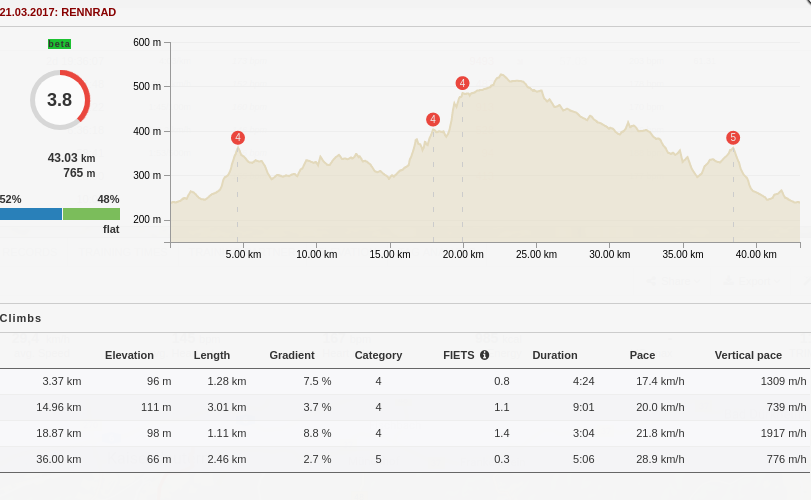
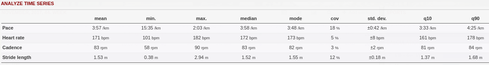
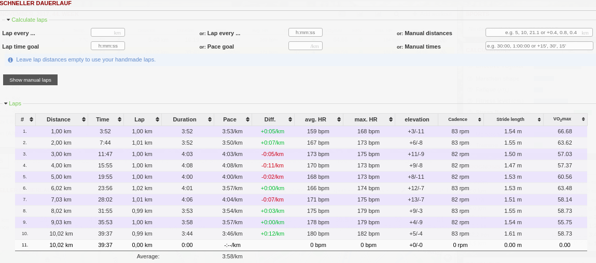
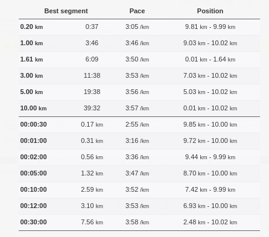
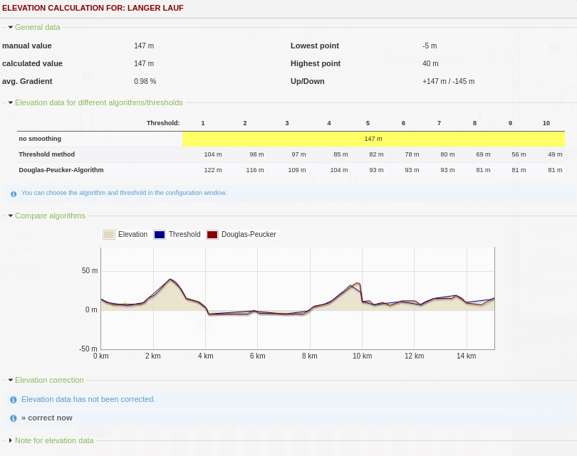
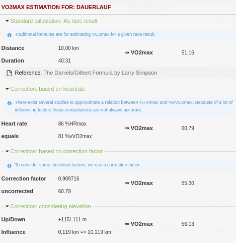

===============
Activity Tools
===============

Climb score
----------------------

Climbing a mountain in running shoes or on the bike is always something special – not just since riders at the Tour de France show us how to conquer the toughest mountains. From now on, RUNALYZE will categorize all climbs in your activities and analyze them, from little hills of the 5th category up to mountains of ‘Hors catégorie’ (HC). The classification is based on the FIETS index, that uses length and gradient profile to calculate a single number for each climb.

In addition, all climbs – no matter whether they are classified or not – are used together with the elevation profile (How much of the course has been hilly?) to calculate an overall score for the activity, the so-called ‘Climb Score’. This score rates how challenging the course was as a single number between 0.0 (completely flat) and 10.0 (very demanding mountain stage).
Can you find the hardest climbs in your region and are you able to manage a course with a Climb Score of 10.0?

 Note: This analysis depends on the quality of given elevation profiles. Noisy elevation data (e.g. gps data) can cause strange numbers.

Analyze time series
----------------------

Split analysis
---------------

Split analysis
---------------

Elevation Correction
----------------------

VO2max Estimation
-------------------

