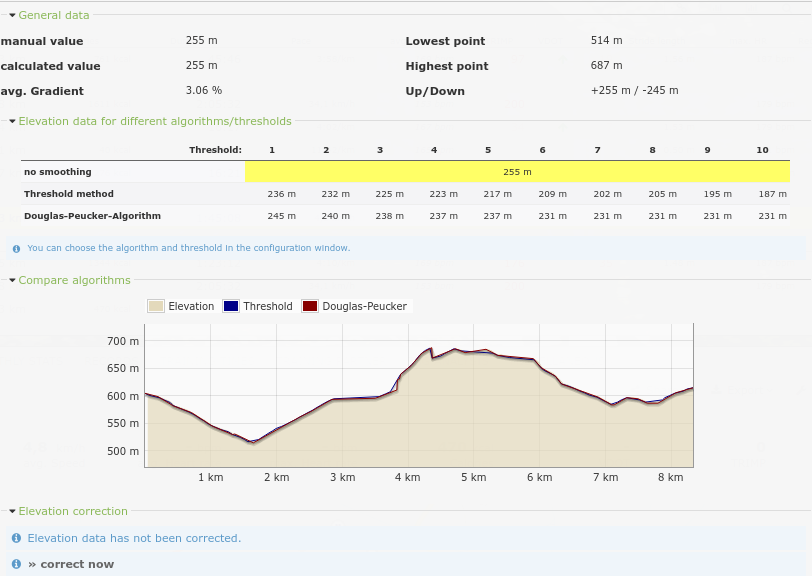

=========
Elevation
=========

One of the most common questions at RUNALYZE is about elevation values. There is a lack of clarity regarding the elevation correction and its calculation. Many people just don't know how elevation has to be handled and why there is no proper value.

Elevation data and elevation correction
****************************************

Recording of activities
-----------------------
Let's start with the recording of an activity. Not only the position in terms of latitude/longitude but also the elevation is determined via GPS.

This sounds great but it isn't: Every owner of a gps-device knows that the GPS quality can vary extremely. Concerning the total distance these variations are negligible. It doesn't matter if you're running 10 meters to the left or right of the way.

But the same variations apply for the recorded elevation – and for elevation it's a significant difference if you are running 10 meters higher or lower.

That's why elevation data obtained via GPS is unusable and an elevation correction is used by default. This applies to any platform like Garmin Connect, Polar Flow as well.

Elevation data from a device should only be used if the device has a barometric altimeter included.

Elevation correction via satellite data
----------------------------------------
The prinicple of elevation correction is quite simple. The respective altitude of every pair of coordinates is determined from some digital elevation model, in general an elevation profile of the global surface.

An example for such a dataset are SRTM files (Shuttle Radar Topography Mission from 2000). They are freely available in a grid of 90x90m. The resolution is not perfect and these datasets are noisy, but they are usually the best fit if there are no barometric measurements.

This dataset can be accessed via public APIs of Geonames.org or GoogleMaps, but the number of requests is limited. At RUNALYZE we're hosting our own SRTM files nowadays to get an accurate elevation profile for your activity.

**Conclusion:** The best elevation profile is obtained via barometric measurements. Users with devices that do not include a barometric altimeter **should always enable the elevation correction**.
But remember: This elevation correction does only mean that we correct the elevation profile (based on satellite data). This does not yield a single, "true" elevation value for your activity.

 * `<https://en.wikipedia.org/wiki/Shuttle_Radar_Topography_Mission>`_
 * `<http://srtm.csi.cgiar.org/>`_
 * `<http://dwtkns.com/srtm/>`_

The calculation of the elevation value (total ascent/descent)
**************************************************************
The problem
------------
Most runners do not only want to see a nice elevation profile. They are interested in their total elevation gain (sometimes just called "elevation" of an activity).

But - and that's probably new to you as you're forced to read this article - obtaining such a value is far away from trivial. Most people think that a fixed elevation profile generates a fixed elevation value, but that's not true.

The problem is that there is no "real" value. Ask yourself: How would do you define this elevation value? As sum of all differences in altitude? Even if it's only 10cm of a sidewalk? And what's with small stones under your feet or potholes?

Be sure: That's not what you want. It's simple to calculate the total elevation of a steady uphill course: highest point - lowest point = elevation gain. But that's not possible for hilly terrains and urban areas.

The solution: smoothing algorithms
-----------------------------------
Our workaround is to "smooth" the elevation profile (only for calculating total elevation).
RUNALYZE currently supports three methods:
 * No smoothing
 * Threshold method
 * `Douglas-Peucker-Algorithm <https://en.wikipedia.org/wiki/Ramer%E2%80%93Douglas%E2%80%93Peucker_algorithm>`_

**No smoothing** is the naive approach to sum up all ups and downs.
You can always change the smoothing algorithm in your settings – afterwards you can let RUNALYZE recalculate all elevation values (Tools -> database cleanup -> Loop through activities (activate "Recalculate elevation" & "Recalculate VDOT values")).
You will notice that without smoothing far too high values will appear.

In the **threshold method** small elevation differences are ignored. The threshold for this can be adjusted in the configuration. We have achieved good results with a threshold of 3 meters. Therefore any difference of only one or two meters is ignored.

If you are moving just slowly uphill or downhill on a course the threshold method will have a problem. All elevation differences between two consecutive data points that are smaller than the threshold will be ignored. That's where the Douglas-Peucker-algorithm comes into play.

The Douglas-Peucker-algorithm ignores some intermediate values (according to a certain algorithm) and tries to consider only significant "ups and downs".

Conclusion
-----------
This is definitely a complicated topic and we can't set your settings such that you obtain "true" values - simply because no one knows them.
There is no 'truth' in this case. But you can adapt the settings to your needs, such that you are satisfied with your calculated values. They won't match your devices values exactly, but that shouldn't be the point.

The information window about the elevation data, which you can open for every activity, can help finding the correct settings.

The original data is compared with the corrected data and our different algorithms. There's a table for the different algorithms and thresholds as well.
