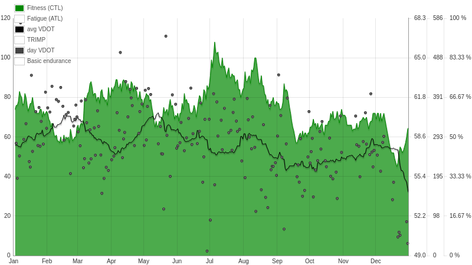
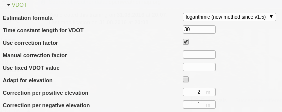

====
VDOT
====

VDOT in RUNALYZE
*****************

VDOT is - according to the originally definition - calculated from a race result.
Having a personal best for 10k, you can use the VDOT of that result to get a prognosis for a half marathon.
This works pretty well, but it requires a current (and "good") race result.

In general, that's not sufficient. Runners want to know about their shape (i.e. optimal training paces and a prognosis for the upcoming race) while training for some event, not right after it.

Therefore, RUNALYZE estimates your current VDOT based on your activities. (Again: it's an estimation - not an exact calculation!)
This estimation is based on your heart rate and your running pace. Tables by Jack Daniels give a rough basis for these calculations.
Your current VDOT shape is based on your average VDOT of the last 30 days.

Still, this estimation is not that easy all the time. The maximal heart rate must be known and the heart rate graph of your activity must not go haywire due to a defect heart rate strap or other influences.
RUNALYZE gives you the option to ignore an activity for your VDOT estimation (e.g. for activities with long pauses) to solve this problem.

In addition, everybody's heart rate may behave differently but Daniels' tables are only a rule of thumb to match most people.
RUNALYZE uses an additional *correction factor* which is just multiplied with the calculated value.
This factor is calculated based on your *best* race and its heart rate.
If this factor does not fit for you, just pick a manual factor (Configuration -> General settings -> VDOT).

.. note::
    In general, we suggest a correction factor between 0.85 and 0.95.

General
********

Speaking of *VDOT*, it's a shortened version of V-dot-O2max, the maximal oxygen uptake rate.
The VDOT itself, defined and invented by Jack Daniels, equals V-dot-O2max plus some additional factors to take the runner's economy/efficiency into consideration.
That's why some people call it a *pseudo V-dot-O2max*.

Jack Daniels' famous `Running Formula* <http://amzn.to/1GnAv43>`_ contains tables for estimating this VDOT. These formulas are used to estimate your VDOT and to predict your race performances.
Your personal VDOT value is estimated based on the ratio of heart rate and pace for each of your runs. The average over a given period is considered as your current shape.

Each VDOT value of an activity in RUNALYZE is marked with an arrow to show if this value is (much) higher than your current shape, equal to it or (much) lower.

VDOT settings
**************

Manual correction factor
-------------------------
If you think your VDOT correction factor, which is based on your best competition is wrong/not perfect, you can add a manual correction factor. A correction factor between 0.85 and 0.95 should be realistic

Adapt VDOT for elevation
------------------------
If you make many vertical meters in your actitivies the VDOT may have a negative influence to your form. You can enable the adaption for elevation in the VDOT settings. You can set the correction per positive and negative elevation.

Further readings and tools
**************************

 * `VDOT calculator (german) <http://www.polar.com/us-en/support/Heart_Rate_Variability__HRV_>`_
 * `Threshold Training: Finding Your VDOT <http://www.runnersworld.com/workouts/threshold-training-finding-your-vdot>`_
 * `VDOT - A 12 Point Guide <https://www.globe-runners.com/?q=node/181>`_
 * `The Math Behind The Daniels/Gilbert Formula <http://www.simpsonassociatesinc.com/runningmath1.htm>`_
 * `Wikipedia about Daniels' VDOT <https://en.wikipedia.org/wiki/Jack_Daniels_%28coach%29#VDOT>`_
 * `Fellrnr about VDOT <http://fellrnr.com/wiki/VDOT>`_
