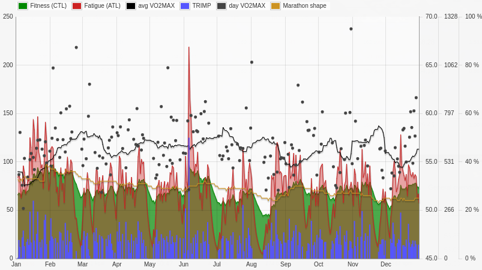

========
|VO2max|
========

|VO2max| in RUNALYZE
********************

|VO2max| is a measure for your personal capabilities and can be calculated based
on a current (and *good*) race result. It can be used to get a prognosis for a
half marathon based on your personal best for 10k or compare your personal bests
of different distances.

In general, that's not sufficient. Runners want to know about their shape (i.e.
optimal training paces and a prognosis for the upcoming race) while training for
some event, not right after it.

Therefore, RUNALYZE estimates your current |VO2max| based on your activities.
(*Again: it's an estimation - not an exact calculation!*)
This estimation is based on your heart rate and your running pace. There are
several studies for an approximate relation between heart rate and percentage of
velocity at |VO2max|. Your current |VO2max| shape is based on the average of the
last 30 days.

Still, this estimation is not that easy all the time. The maximal heart rate
must be known and the heart rate graph of your activity must not go haywire due
to a defect heart rate strap or other influences. RUNALYZE gives you the option
to ignore an activity for your |VO2max| estimation (e.g. for activities with
long pauses) to solve this problem.

In addition, everybody's heart rate may behave differently and does not need to
follow the approximate equations. RUNALYZE uses an additional
*correction factor* which is just multiplied with the calculated value.
This factor is calculated based on your *best* race and its heart rate.
If this factor does not fit for you, just pick a manual factor
(*Configuration -> General settings -> |VO2max|*).

.. note::
    In general, we suggest a correction factor between 0.85 and 0.95.

General
********

|VO2max| is a scientific metric for the maximal oxygen uptake that is highly
correlated with your maximal running performance, but depends on the runners
efficiency. Two runners with equal |VO2max| values do not need to perform
equal. That's why we use the *Effective |VO2max|* that somehow ignores the
efficiency and *is* equal for runners with same results for e.g. a 10k race.
In addition to common calculators that estimate |VO2max| based on a race
result, we estimate your |VO2max| for every activity based on the relation of
your heart rate and pace.

Each |VO2max| value of an activity in RUNALYZE is marked with an arrow to show
if this value is (much) higher than your current shape, equal to it or (much)
lower.

|VO2max| settings
*****************

.. figure:: images/vo2max-settings.png
   :alt: VO2max configuration settings in RUNALYZE

Manual correction factor
-------------------------
If you think your |VO2max| correction factor, which is based on your best
competition is not accurate, you can use a manual factor. Based on our
experience, values between 0.85 and 0.95 seem to be realistic.

Adapt |VO2max| for elevation
----------------------------
If you run a lot up- and downhill, the effective work is more than the distance
itself reflects. You can enable the adaption for elevation in the |VO2max|
settings and set the correction (of the total distance) per positive and
negative elevation.

Further readings and tools
**************************

 * `Fellrnr about VO2max <http://fellrnr.com/wiki/VO2max>`_
 * `Running for fitness: What is VO2 max? <http://www.runningforfitness.org/faq/vo2-max>`_
 * `Runners connect: VO2 Max for Runners <https://runnersconnect.net/running-training-articles/vo2-max-for-runners/>`_
 * `The Math Behind The Daniels/Gilbert Formula <http://www.simpsonassociatesinc.com/runningmath1.htm>`_

.. |VO2max| replace:: VO\ :sub:`2`\ max
