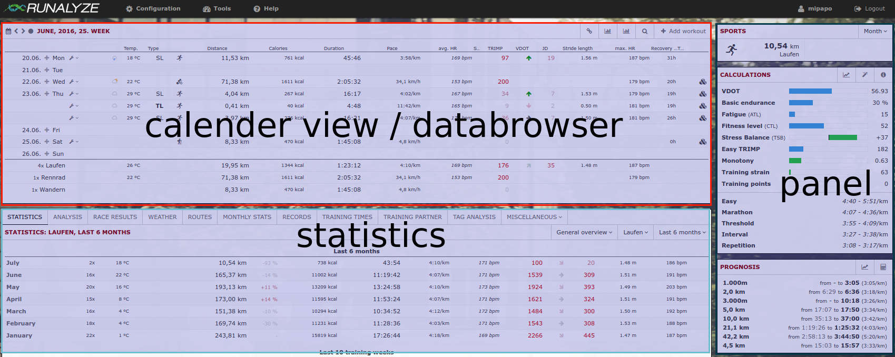
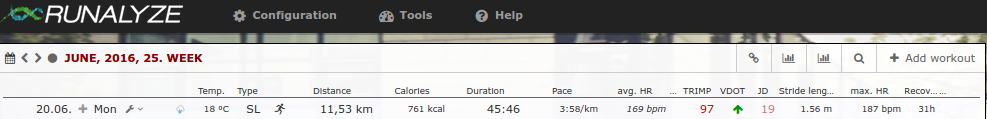
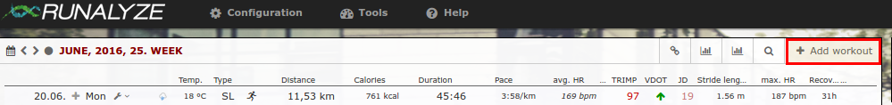

===============
Getting started
===============

We are very happy that you joined RUNALYZE!
We are a small team (`Hannes <https://blog.runalyze.com/team/hannes/>`_,
`Michael <https://blog.runalyze.com/team/michael/>`_ and
`Neele <https://blog.runalyze.com/team/neele/>`_), working on RUNALYZE only
during leisure time. We still try to improve RUNALYZE as much as possible and
adapt it to your needs every day.

You may have logged in for the first time and you may be overwhelmed by all the
information so far. We can assure that you will getting comfortable after a
couple of days with RUNALYZE!

There are three sections
*************************

Calendar view / databrowser
----------------------------
Here you find a short overview of all your activities within any chosen period.
You can navigate through all weeks/months/years (using the arrow icons) or
select any time period (calendar icon). The set of values shown in this table is
configurable. Go to "*Configuration -> Dataset*" and select the data you're most
interested in.

Statistics
-----------
The main focus of RUNALYZE is on statistics about your activities. We provide
several "staticstic plugins" where you can find a lot of different evaluations
of your activities. Be it your route map, your race results, activity records or
a retrospect by the months - it's all there (and if not, just ask us to add it).

As always: You can decide which statistics should appear and order the active
ones according to your desires ("*Configuration -> Plugins*").

Panels
------
The panels give a quick overview of the most important data. You can have a look
at your shape or keep an eye on your equipment and training progress.

Configure your account
**********************
Different countries, different units of lengths and temperatures - You can
change them! RUNALYZE comes with a large set of configuration settings so that
you can adjust the output at many points. Just take a look at your
configuration. Whenever the meaning of a setting is unclear, hove the label with
your mouse to see the tooltip with additional hints.

.. note::
    If you have misconfigured something and can't remember the old values you
    can reset the configuration in your account configuration.

Import/Create an activity
**************************
We provide `a guide <import.html>`_ how to import your (old) activities from
several devices and platforms.

We plan to provide a synchronization with other apps such that you don't need to
manually upload your activities, but this work is still in progress.

And, however, we think there's a clear benefit in creating/importing your
activities manually. By this means you'll think about the training again and add
some more details instead of hoping that the synchronization tool does all the
magic for you.

What can I expect from RUNALYZE in the future?
***********************************************
 * A new (clear, responsible) Design (the current one is 'slightly' outdated)
 * Automatic synchronization with other apps / vendors
 * Easier & clearer configuration
 * Better documentation of the various parameters and statistics
 * Optional community functions
 * Better support for swimming and cycling

"I have an idea / a question / a problem"
******************************************
We are pleased to help! To ensure that all users benefit from your request we
ask you to use `our forum <https://forum.runalyze.com/>`_ (english & german).
Make sure first whether your question has been answered already or is part of
our documentation.
