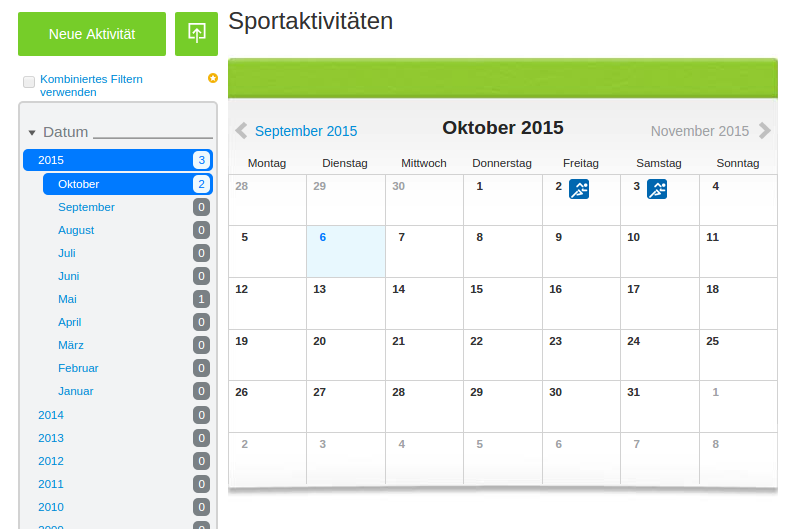

==================
Import activities
==================

We know that you have a whole bunch of activities you would like to import.
RUNALYZE supports a wide range of file types and tries to fit all your needs.
Still, some file types can be tricky.

.. note::
          We always import all data that we can read from your file.

Devices
*******
Garmin
------
Some years ago, it was easy to sync your Garmin device via the so called *Garmin communicator*.
We did not remove this option so far but the browser plugin itself is officially discontinued.

Newer Garmin devices can be used as ordinary usb mass storage. Just pick your \*.fit file from a directory called *ACTIVITIES* or similar.
If your device synchronizes with Garmin Connect automatically you can download your activity as zipped \*.fit file from the activity's page (look for the "*original format*").

If you are using Garmin Express or the old ANT-Agent you can upload the files from your Windows, MacOS or Linux system. Just look for the files in the following directories.

^^^^^^^^^^^^^^^
Garmin Express
^^^^^^^^^^^^^^^
Windows 8::

    C:\ProgramData\Garmin\GarminConnect\[foldername can be different (name of the device)]\FIT_TYPE_4

Windows 7::

    C:\ProgramData\Garmin\CoreService\Devices\[ID]\Sync\FIT_TYPE_4

Mac OS X::

    ~/Library/Application Support/Garmin/GarminConnect/Device-UnitID/Upload/FIT_TYPE_4

^^^^^^^^^
ANT-Agent
^^^^^^^^^
Windows:
Open in the windows file explorer the following path::

    %appdata%\Garmin\Devices
Then you have to open the folder with your device ID as name and find the folder *Activities*.

Mac OS X::

    Macintosh HD/Users/BENUTZERNAME/Library/Application Support/Garmin/Devices/DEVICE-ID

^^^^^
Linux
^^^^^
There is a tool called `antf-cli <https://github.com/Tigge/antfs-cli>`_.
That tool should work with any compliant ANT-FS device in theory and it certainly does for Garmin Forerunner (60, 70, 405CX, 310XT, 610, 910XT) and Garmin Swim.

Polar
-----

There is a software called `bipolar <https://github.com/pcolby/bipolar>`_ which can download the activites from Polar FlowSync, PolarV800 or Polar Loop
and there is another software called `V800 Downloader <https://github.com/profanum429/v800_downloader>`_ on Github which does nearly the same.

TomTom Runner/Multisport Cardio
--------------------------------
It seems that all files will be stored on your computer as soon as you connect your device::

    OS (C:) / user / <name of user> / Tom Tom MySports / <name of clock >
There you'll find a folder for every day with \*.ttbin files.

Have a look at the following article at `dcrainmaker.com <http://www.dcrainmaker.com/2014/01/releases-uploading-multisport.html>`_ if you're using the iPhone App.

If you're using a MAC/Linux system you can get the files `via usb <https://github.com/ryanbinns/ttwatch>`_ or `via bluetooth <https://github.com/dlenski/ttblue>`_ from your watch.

Suunto
------

Apps & Webservices
******************
.. note::
          Yes: We'll add an API to enable synchronization with other plattforms, e.g. via tapiriik, some day.

Endomondo
---------
| \- Does not encode pauses [#encodepauses]_

Strava
---------
| \- Does not encode pauses [#encodepauses]_

Runtastic
---------
|  \- Resampled file [#resampleddata]_
|  \- Does not encode pauses [#encodepauses]_

**How to export all activities**

By default, Runtastic does only provide a way to export single activities.
With a little trick you can download all activites at once:

Drag the following link to your toolbar/bookmars

.. raw:: html

     <a href="javascript:(function(){$.each(index_data,function(){$('<iframe/>', {src: 'https://'+app_config.domain+user.run_sessions_path+this[0]+'.tcx'}).appendTo('body');});})();" title="Download activities from runtastic">Download runtastic</a>

Open the activity overview on the runtastic homepage

and click on the bookmark.

(Thanks to `blog.favo.org <http://blog.favo.org/post/56040226362/export-all-activities-from-runtastic-as-tcx>`_)

Garmin Connect
--------------
**How to download all activites**

You need to be a bit technique affin for this. Python and the python package `mechanize` must be installed on your system.
Now you need to `download this script <https://github.com/mipapo/garmin/archive/master.zip>`_.
Execute the `download.py` script::

    python download.py -u <Username at garmin connect>

You will be asked for your password. Type in your password. After a few seconds the download of all activites should start.

sports-tracker.com
-------------------

Try to download all activities with the tool `by Olivian Daniel Tofan <http://daniel.toffee.ro/2014/04/25/liberate-sportstracker-workouts>`_

Trainingstagebuch.org
----------------------
**How to export all activities as .gpx files**

Drag the following link to your toolbar/bookmarks

.. raw:: html

     <a href="javascript:(function(){var arr = [], l = document.links;for(var i=0; i<l.length; i++) { if( l[i].href.indexOf('http://trainingstagebuch.org/workouts/show/') >= 0){ var newFrame = document.createElement('iframe'); document.body.appendChild(newFrame);  newFrame.style = 'width: 1px; height: 1px;'; link = 'http://trainingstagebuch.org/map/export/'+l[i].href.replace('http://trainingstagebuch.org/workouts/show/','')+'?view=gpx';  console.log(link);newFrame.src = link; }}})();" title="Download trainingstagebuch.org">Download trainingstagebuch.org</a>

Open the `activity list page <http://trainingstagebuch.org/workouts/list?rows=320>`_ at trainingstagebuch.org and click on the bookmark. The download of the acitivies will begin. Repeat this step for every activity list page.

Nike+
-------
|  \- Does not encode pauses [#encodepauses]_

MapMyRun
--------
|  \- Does not encode pauses [#encodepauses]_

iRunner
--------
|  \- Does not encode pauses [#encodepauses]_

Run.GPS
--------
| \+ high precision data

Different file types
********************
We get a lot of questions regarding file types: Which one is better and which one contains more data?
To answer these questions we have created a table to show what we can import from each file type (as long as your device logged this data).

Please send us an example file if you think we are missing some data during the import.

  * N = No
  * M = Maybe
  * C = Will be calculated if not present
  * CC = Will be calculated when a condition is given

  .. note::
            Distances may be recalculated in some cases, when there are no distance information for gps datapoints.

+---------------------------------+--------+-----------+---------+---------+------------+----------+--------------+---------+---------+---------+---------+-------------+------------+------+
| Type                            | FIT    | TCX/TTBIN | GPX     | PWX     | hrm & gpx  | Fitlog   | Logbook (3)  | kml/kmz | TRK     | sml     | slf     | xml(Suunto) | csv(Epson) | hrm  |
+=================================+========+===========+=========+=========+============+==========+==============+=========+=========+=========+=========+=============+============+======+
| Distance                        | ✓      | ✓         | ✓       | ✓       | ✓          | ✓        | ✓            | ✓       | ✓       | ✓       | ✓       | ✓           | ✓          | ✓    |
+---------------------------------+--------+-----------+---------+---------+------------+----------+--------------+---------+---------+---------+---------+-------------+------------+------+
| Startdate/time                  | ✓      | ✓         | ✓       | ✓       | ✓          | ✓        | ✓            | ✓       | ✓       | ✓       | ✓       | ✓           | ✓          | ✓    |
+---------------------------------+--------+-----------+---------+---------+------------+----------+--------------+---------+---------+---------+---------+-------------+------------+------+
| Duration                        | ✓      | ✓         | ✓       | ✓       | ✓          | ✓        | ✓            | ✓       | ✓       | ✓       | ✓       | ✓           | ✓          | ✓    |
+---------------------------------+--------+-----------+---------+---------+------------+----------+--------------+---------+---------+---------+---------+-------------+------------+------+
| Sporttype                       |        |           |         |         |            |          |              |         |         |         |         |             |            |      |
+---------------------------------+--------+-----------+---------+---------+------------+----------+--------------+---------+---------+---------+---------+-------------+------------+------+
| Name                            |        |           |         |         |            |          | ✓            |         |         |         | N       |             |            |      |
+---------------------------------+--------+-----------+---------+---------+------------+----------+--------------+---------+---------+---------+---------+-------------+------------+------+
| Notes                           |        | ✓         |         |         |            |          | ✓            |         |         |         | ✓       |             |            |      |
+---------------------------------+--------+-----------+---------+---------+------------+----------+--------------+---------+---------+---------+---------+-------------+------------+------+
| Heartrate                       | ✓      | ✓         | ✓       | ✓       | ✓          | ✓        | ✓            | ✓       | ✓       | ✓       | ✓       |             | ✓          | ✓    |
+---------------------------------+--------+-----------+---------+---------+------------+----------+--------------+---------+---------+---------+---------+-------------+------------+------+
| Calories                        | ✓/C    | ✓/C       | C       | C       | C          | ✓/C      | ✓/C          | ✓/C     | ✓/C     | ✓/C     | ✓/C     | C           | ✓          | C    |
+---------------------------------+--------+-----------+---------+---------+------------+----------+--------------+---------+---------+---------+---------+-------------+------------+------+
| GPS                             | ✓      | ✓         | ✓       | ✓       | ✓          | ✓        | N            | ✓       | ✓       | ✓       | ✓       |             | ✓          |      |
+---------------------------------+--------+-----------+---------+---------+------------+----------+--------------+---------+---------+---------+---------+-------------+------------+------+
| Altitude                        | ✓      | ✓         | ✓       | ✓       | ✓          | ✓        | N            | ✓       | ✓       | ✓       | N       |             | ✓          | ✓    |
+---------------------------------+--------+-----------+---------+---------+------------+----------+--------------+---------+---------+---------+---------+-------------+------------+------+
| Temperature                     | ✓      | ✓         | ✓       | ✓       | ✓          | ✓        | N            | N       | ✓       | ✓       | N       |             | ✓          | N    |
+---------------------------------+--------+-----------+---------+---------+------------+----------+--------------+---------+---------+---------+---------+-------------+------------+------+
| Laps/Rounds                     | ✓      | ✓         | ✓       | ✓       | ✓          | ✓        | ✓            | N       | N       | ✓       | N       |             | ✓          |      |
+---------------------------------+--------+-----------+---------+---------+------------+----------+--------------+---------+---------+---------+---------+-------------+------------+------+
| Pauses                          | ✓      | ✓         | ✓       | N       | ✓          | ✓        | N            | ✓       | N       | N       | N       |             | ?          |      |
+---------------------------------+--------+-----------+---------+---------+------------+----------+--------------+---------+---------+---------+---------+-------------+------------+------+
| Cadence (spm/rpm)               | ✓      | ✓         | ✓       | ✓       | ✓          | N        | N            | N       | N       | ✓       | N       |             | ✓          | ✓    |
+---------------------------------+--------+-----------+---------+---------+------------+----------+--------------+---------+---------+---------+---------+-------------+------------+------+
| Power                           | ✓      | ✓         | N       | ✓       | ✓          | N        | N            | N       | N       | N       | N       |             |            |      |
+---------------------------------+--------+-----------+---------+---------+------------+----------+--------------+---------+---------+---------+---------+-------------+------------+------+
| Stride length                   | CC     | CC        | CC      | CC      | CC         | N        | N            | N       | N       | C       | N       |             | CC         | CC   |
+---------------------------------+--------+-----------+---------+---------+------------+----------+--------------+---------+---------+---------+---------+-------------+------------+------+
| Ground Contact Time             | ✓      | N         | N       | N       | N          | N        | N            | N       | N       | N       | N       |             |            | N    |
+---------------------------------+--------+-----------+---------+---------+------------+----------+--------------+---------+---------+---------+---------+-------------+------------+------+
| Ground Contact Balance          | ✓      | N         | N       | N       | N          | N        | N            | N       | N       | N       | N       |             |            | N    |
+---------------------------------+--------+-----------+---------+---------+------------+----------+--------------+---------+---------+---------+---------+-------------+------------+------+
| Vertical oscillation            | ✓      | N         | N       | N       | N          | N        | N            | N       | N       | N       | N       |             |            | N    |
+---------------------------------+--------+-----------+---------+---------+------------+----------+--------------+---------+---------+---------+---------+-------------+------------+------+
| Vertical ratio                  | CC     | N         | N       | N       | N          | N        | N            | N       | N       | N       | N       |             |            | N    |
+---------------------------------+--------+-----------+---------+---------+------------+----------+--------------+---------+---------+---------+---------+-------------+------------+------+
| Swim Strokes                    | ✓      | N         | N       | N       | N          | N        | N            | N       | N       | N       | N       |             | N          | N    |
+---------------------------------+--------+-----------+---------+---------+------------+----------+--------------+---------+---------+---------+---------+-------------+------------+------+
| Swim Stroke type                | ✓      | N         | N       | N       | N          | N        | N            | N       | N       | N       | N       | N           | N          | N    |
+---------------------------------+--------+-----------+---------+---------+------------+----------+--------------+---------+---------+---------+---------+-------------+------------+------+
| HRV                             | ✓      | N         | N       | N       | N          | N        | N            | N       | N       | ✓       | N       | ✓           | N          | ✓    |
+---------------------------------+--------+-----------+---------+---------+------------+----------+--------------+---------+---------+---------+---------+-------------+------------+------+

.. [#resampleddata] The idea of resampling data is to reduce the size of files and/or to simplify the process of generating the map for an activity. When you import such data it is nearly impossible to calculate the length of the activity. Sometimes the pace graph will show useless lines.

.. [#encodepauses] Pauses can be encoded in TCX/GPX files with closed tracks/tracks segements. If they are not encoded RUNALYZE has to guess where pauses took place. If you have problems you can disable the detection of pauses in (General settings -> Activity form -> Detect pause)

.. note::
          This site may contain affiliate links to support the development and infrastructure of RUNALYZE
