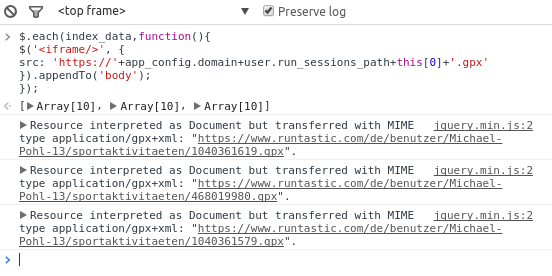

=======================
Import (old) activities
=======================

We know that you have a bunch of activities you would like to import to RUNALYZE. To make it quite simple we support a lot of different file types.
Some of them are sometimes a bit tricky.

.. note::
          We always import all data we can read from any device/file.

Devices
*******
Garmin
------
There was a time when the Garmin Communicator was great to easily import activities from the different devices. But sadly they (had to) discontinued this tool due to the support of the browser manufactures.
Garmin stores the activities in the *.FIT format, which can be read by RUNALYZE since version 2.0.

When you are using Garmin Express or the old ANT-Agent from Garmin you can upload the files from your Windows, MacOS or Linux system.

^^^^^^^^^^^^^^^
Garmin Express
^^^^^^^^^^^^^^^
Windows 8::

    C:\ProgramData\Garmin\GarminConnect\[foldername can be different (name of the device)]\FIT_TYPE_4

Windows 7::

    C:\ProgramData\Garmin\CoreService\Devices\[ID]\Sync\FIT_TYPE_4

Mac OS X::

    ~/Library/Application Support/Garmin/GarminConnect/Device-UnitID/Upload/FIT_TYPE_4

^^^^^^^^^
ANT-Agent
^^^^^^^^^
Windows:
Open in the windows file explorer the following path::

    %appdata%\Garmin\Devices
Then you have to open the folder with a several different numbers. Then you should find the folder *Activities*

Mac OS X::

    Macintosh HD/Users/BENUTZERNAME/Library/Application Support/Garmin/Devices/DEVICE-ID

^^^^^
Linux
^^^^^
There is a tool called "antf-cli" which you can find on github (https://github.com/Tigge/antfs-cli)
That tool should work with any compliant ANT-FS device in theory, but is definitly working with the Garmin Forerunner (60, 405CX, 310XT, 610, 910XT), Garmin FR70, Garmin Swim

Polar
-----

TomTom
------
Mac OS:
Data seems just be generated, when the Mac is online::

    OS (C:) / user / <name of user> / Tom Tom MySports / <name of clock >
There you should find a folder for every day with *.ttbin files.

Suunto
------

Apps & Webservices
******************
.. note::
          In the future we will have an API to implement a continuing import of other webservices.
          Yes, we want to add our service to tapiriik.

Endomondo
---------
| \- Does not encode pauses [#encodepauses]_

Strava
---------
| \- Does not encode pauses [#encodepauses]_

Runtastic
---------
|  \- Resampled file [#resampleddata]_
|  \- Does not encode pauses [#encodepauses]_

**How to export activities out of runtastic**

Normally runtastic only provides a single export (tcx or gpx) of activities. If you have a lot of activities it can take a long time to export it.
But with a little trick you can download all activites at once with a script, which has to be executed in the browser console.

Open the activity overview on the runtastic homepage

.. image:: images/runtastic-import-1.png

Now open the browser web console
( `Firefox <https://developer.mozilla.org/en-US/docs/Tools/Web_Console>`_) ( `Chrome <https://developers.google.com/web/tools/javascript/console/console-ui>`_)

and execute this tiny script (Thanks to `blog.favo.org <http://blog.favo.org/post/56040226362/export-all-activities-from-runtastic-as-tcx>`_) ::

    $.each(index_data,function(){
    $('<iframe/>', {
    src: 'https://'+app_config.domain+user.run_sessions_path+this[0]+'.tcx'
    }).appendTo('body');
    });

Hit enter and it should look like this. The download of all activities should begin.

Garmin Connect
--------------

Nike+
-------
|  \- Does not encode pauses [#encodepauses]_

MapMyRun
--------
|  \- Does not encode pauses [#encodepauses]_

iRunner
--------
|  \- Does not encode pauses [#encodepauses]_

Run.GPS
--------
| \+ high precision data

Different file types
********************
We get a lot of questions regarding the file types. Which one is better and which one contain more data.
To clear up these question we will answer these question in the following section.

FIT
---
 \+ Contains data like cadence, swimtype (strokecount ...)

TCX
---
| \+ Pauses can exists
| \+ expandable format (May contain more data - RUNALYZE support some of these extension. If you think anything important is missing just open an issue or write a mail to us)

GPX
---
| \+ May contain pauses & laps
| \+ Heartrate and other data can be available through gpx extensions

ttbin
-----

logbook & logbook3
------------------
| \+ Contains general activity information like distance, time
| \+ Support laps
| \- GPS, Heartrate and other track information can not be imported by us

slf
---

pwx
---

hrm/gpx (combined)
------------------

.. [#resampleddata] The idea of resampling data is to reduce the size of files and/or to simplify the process of generating the map for an activity. When you import such data it is nearly impossible to calculate the length of the activity. Sometimes the pace graph will show useless lines.

.. [#encodepauses] Pauses can be encoded in TCX/GPX files with closed tracks/tracks segements. If they are not encoded RUNALYZE has to guess where pauses took place. If you have problems you can disable the detection of pauses in (General settings -> Activity form -> Detect pause)

.. note::
          This site may contain affiliate links to support the development and infrastructure of RUNALYZE
