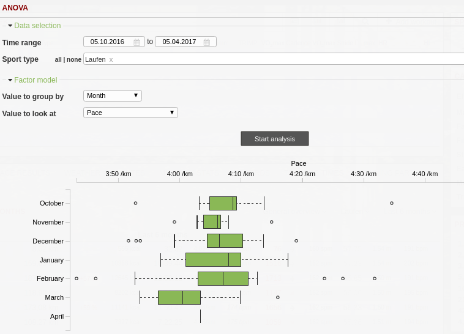
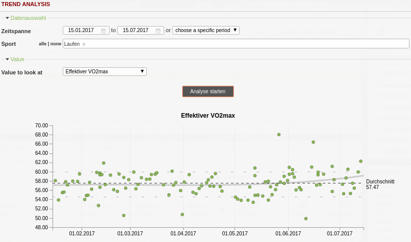
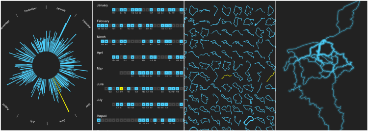

======
Tools
======

ANOVA Tool
-----------

Values are visualized with so-called ‘box plots’. They give an impression of how values of a group are distributed. The middle 50% of all values are within the box itself and the so-called whiskers have a length of at most 1.5-times the interquartile range (i.e. the box’s width). Data points outside this range are called outliers.

This way of presentation allows to compare not only average values (e.g. pace over months) but deviations and outliers between different groupings. For a detailed explanation of box plots, see `Wikipedia <https://en.wikipedia.org/wiki/Box_plot>`_

Trend Analysis
---------------

There’s a new tool to keep an eye on the long-term progress of your activity data. The trend analysis tool allows to plot single activity values (e.g. pace, distance, duration, running dynamics, …) for a given period to see how your values evolved. This way you can check the long-term trend of your metrics like cadence or pace.

In addition to the activity values, which are shown as points, median, 10%- and 90%-quantile and a polynomial trend line (fourth order) are shown.

Poster Tool
---------------

Based on your data RUNALYZE can generate some posters for you. You can choose between a route heatmap, a route grid, circular or calendar.
